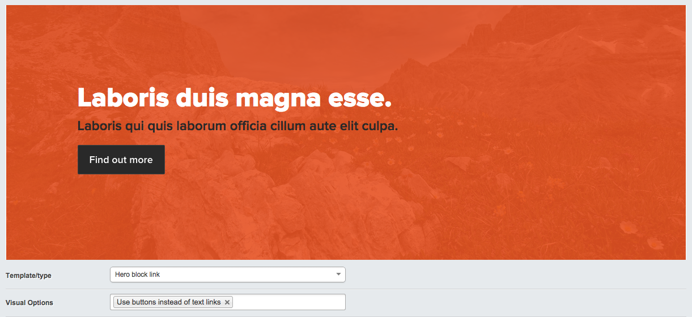

# Content Slices for SilverStripe

Content management in "slices"; separate content components, each with their own template, fields and visual settings that can be created and arranged by a user in the CMS.

* Slice previews in the CMS
* Slice CMS configured via YAML

## Usage

It's best to use silverstripe-slices with lots of generic fields on the base slice class, since this allows templates to share fields and be configured in YAML without creating a class for each slice. [silverstripe-adaptivecontent](https://github.com/heyday/silverstripe-adaptivecontent) works well for this (and used to be integrated with this module).

```yaml
# Use the generic fields in silverstripe-adaptivecontent
Slice:
  extensions:
    - 'AdaptiveContent'
    - "AdaptiveContentRelated('Page')"
```

### Templates

Each slice type/template has it's own template file with the name `[BaseSliceClass]_[TemplateName]`. These can go in `themes/[theme]/templates/Slices` to separate them from the other templates in your site. 

### Adding Slices to Page

This module comes with an extension for easily setting up Slices on Page:

```yaml
Page:
  extensions:
    - PageSlicesExtension
```

In templates, all slices can be rendered using this:

```html
<% if $Slices %>
    <% loop $Slices %>
        $forTemplate
    <% end_loop %>
<% end_if %>
```


### Subclassing Slice

Subclassing `Slice` is a normal use case, however note that when subclassing it, you'll need to override the method `getBaseSliceClass` method in your "base" slice subclass (the one you point to in a has_many from Page) for the slice to save correctly:

```php
class ContentSlice extends Slice
{
    protected function getBaseSliceClass()
    {
        return __CLASS__;
    }
}

class VideoSlice extends ContentSlice
{
    // Subclasses of your 'base' subclass don't need anything special
}
```

This is due to the the module needing a "default" class to fall back to when the `className` key has not been set in a template config.

#### Customising CMS fields

Adding and modifying fields in `YourBaseSlice::getCMSFields` is an expected use case. Note that things configured in the slices YAML configuration will be overriden if, for example, you replace a field with something custom. In this case, you can re-apply the slices config with the following at the end of your `getCMSFields` function:

```php
// Re-apply slices config
$config = $this->getCurrentTemplateConfig();
$this->configureFieldsFromConfig($fields, $config);
```

#### Customising slice previews in the CMS



A preview of a slice renders the CMS in an iframe when editing and browsing. Out of the box, previews are rendered inside a basic HTML page wrapper: `silverstripe-slices/templates/SliceWrapper.ss`. You can override this wrapper in your own theme to customise how slice previews are delivered.

### Example config

```yaml
Slice:

  # Define stylesheets to be used when previewing slices in the CMS
  previewStylesheets:
    - /themes/base/css/styles.css

  # Automatically configure the upload folder for these file fields on Slice
  # Files and images will be uploaded to assets/Uploads/Slices/[TemplateName]
  uploadFolderFields:
    - LeadImage
    - SecondaryImage
    - LeadFile

  # The default slice template can be specified, or defaults to the first defined
  # This is just what is selected by default when a new slice is created
  defaultTemplate: TwoColumnImage

  templates:
    Quote:
      fields:
        Title: Quotee
        Content:
          # Set the CMS "title" of the field
          label: Quote

          # Change the form component used for this field
          fieldClass: TextareaField

          # Cast the field to something when rendering it in the template
          casting: Text

          # Value to use for the field's "right title"
          help: ~20 - 30 words

          # Value to use when previewing what the slice will look like
          exampleValue: Dolor exercitation sint ad minim et deserunt nisi aliquip cillum laboris ipsum esse nulla commodo cupidatat ipsum proident exercitation veniam

      # Options exposed in the CMS for configuring the slice template
      # The key is accessible in templates, and the value is used as the CMS title
      visualOptions:
        no-icon: No icon
        bold-quote: Bold quoted text


    TwoColumnImage:
      # Name to show for the template in the CMS
      name: Two column with image

      # Class to change to when using this template
      # This allows complex slices to have extra fields and code
      className: TwoColumnImageSlice

      # Fields that only need a label configured can be defined using a shortcut:
      # (The order fields are defined here also controls the order they show in the CMS)
      fields:
        Title: ~
        Content: Text column
        LeadImage:
          name: Image
          # Images can be specified as file names in example content
          exampleValue: themes/base/images/examples/random-guy.jpg

      visualOptions:
        image-right: Image in right column
        title-centered: Center title above columns
```

## Compatibility

This module requires at least SilverStripe 3.1 and PHP 5.3.
